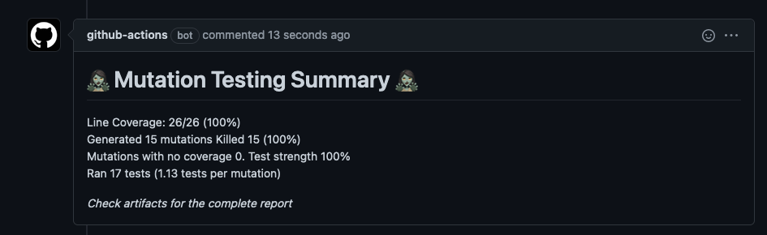

# Introduction
<p>
    <a href="https://github.com/isamadrid90/gradle-pitest-comment-action/releases/tags">
        </a>
    

</p>


This is a POC to make it easier to include mutation testing as a part of a regular pipeline,
it has a lot of room to improvement.

If you find this action useful let me know by adding a ⭐ this encourage me to keep working on it.

What it does ❓
============

The purpose of this action is to execute pitest, upload the report as an artifact and
add a comment with the summary of the execution

Prerequisites 📝
============

* Gradle
* PITest plugin

```kotlin
plugins {
    id("info.solidsoft.pitest") version "1.7.0"
}
```

* PITest configuration working in local, here an example:

```kotlin
pitest {
    setProperty("junit5PluginVersion", "0.12")
    setProperty("targetClasses", listOf("package-to-check"))
    setProperty("outputFormats", listOf("HTML")) //this is important because it will update it as an artifact
}
```

How to use it 🛠️
=============

Add action as step

```yaml
uses: isamadrid90/gradle-pitest-comment-action@v1.0.0-beta
with:
  repo-token: ${{ secrets.GITHUB_TOKEN }}
  reports-retention: 1
  reports-path: "project/build/reports/pitest"
  working-directory: project
```

Inputs
-------

| Name              | Value  | Default                | Required | Description                                    |
|-------------------|--------|------------------------|----------|------------------------------------------------|
| repo-token        | String | -                      | yes      | Token to upload reports as artifact            |
| reports-retention | Int    | 1                      | no       | Retention for the uploaded reports             |
| reports-path      | String | "build/reports/pitest" | no       | The path where the pitest reports are saved    |
| working-directory | String | "."                    | no       | Path to directory where gradle can be executed |

Screenshots 📸
=============

